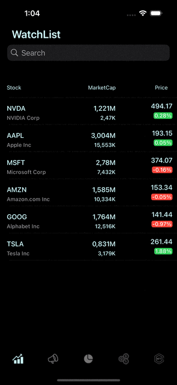
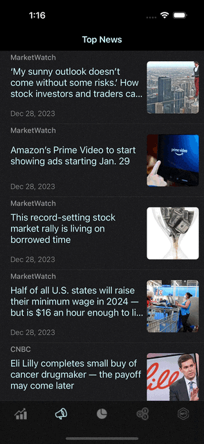
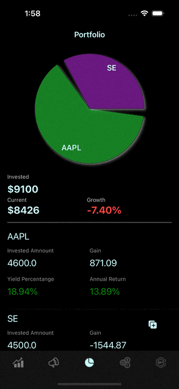
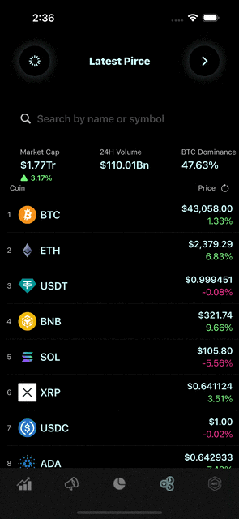

# CaveTickers

## A Stock and Cryptocurrency Tracking iOS APP

- **MVVM Pattern with Combine framework.**
  - Integrated SwiftUI views and UIKit by using HostingViewController, enhancing development flexibility.

- **Watchlist to stock detail view**

- **Searched and saved user’s own watchlist in UserDefaults.**

- **Provided the most recent news**
- Managed and allocated different APIs to ensure the latest market news.

- **Stored users investment portfolio in Core Data**
- Calculated the return based on current market prices.

- **Stored users investment portfolio in Core Data**
- Calculated the return based on current market prices.

- **Stored users investment portfolio in Core Data**
- Calculated the return based on current market prices.

- **Supported MetaMask and blockchain connections**, enabling users to access their cryptocurrency wallet balance and NFT collections.
  
